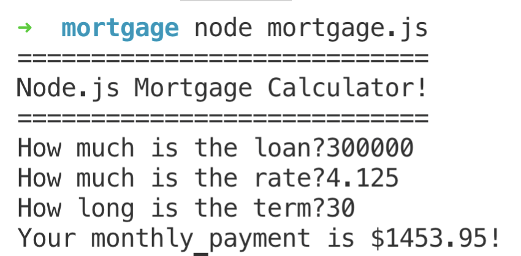

# Read this whole document before doing any work!

What's cooler than an online tip calculator?
An online mortgage calculator!

The basic concept is of course the same:

- Ask the user a series of questions
- Do some math once the user submits their answers
- Show a result on the screen

The math is just a **teensy weensy** more complicated. After reading [this article](https://www.wikihow.com/Calculate-Mortgage-Payments#Calculating_Mortgage_Payments_with_an_Equation), I wrote a function for you below that you can use instead of dealing with the math yourself.

```js
function calculateMonthlyPayment(principal, annualRate, numberOfYears) {
  const monthlyRate = annualRate / 12 / 100;
  const numberOfPayments = numberOfYears * 12;
  const numerator = monthlyRate * (1 + monthlyRate) ** numberOfPayments;
  const denominator = (1 + monthlyRate) ** numberOfPayments - 1;
  return principal * (numerator / denominator);
}
```

You can see that the function `return`s the monthly mortgage payment, which can then be stored in a constant.

```js
const principal = 300000;
const annualRate = 4.125;
const numberOfYears = 30;

const payment = calculateMonthlyPayment(principal, annualRate, numberOfYears);

console.log(payment); // 1453.949197494022
```

# The Big Idea

Create a program that asks the user three questions:

- What is the principal on the loan?
- What is the annual rate of the loan?
- What is the term (in years) of the loan?

And then shows the user the monthly payment for the loan.

You can do this work **either** in the `mortgage.js` **or** inside the `mortgage.html` file inside this repository. We have started off each file for you. **BONUS POINTS** if you can complete both tasks in the alotted time.

## Setup

- [ ] Clone this repo and cd into it.
- [ ] Create an issue called "My Mortgage Calculator" and assign it to yourself. Assign it a label of "enhancement."
- [ ] Checkout a branch for your work with the naming convention `enhancement-(issue-number)-(your-name)-(issue-description)`
- [ ] Run `yarn` -- this will make sure you have `readline-sync` correctly installed for this project.

## Instructions (mortgage.js)

Only do this section if you will be completing this challenge with Node.js.

- Use the `readline-sync` library to ask the user for the the principal, rate, and term of the loan.
- Convert their answers into numbers. If the answers are not numbers, or are negative, log an error message to the console and ask again.
- Calculate the monthly payment using the function above, and log it to the console.

Your program should look something like this when finished:


---

## Submitting

- [ ] Add, commit, and push your work up to your branch on GitHub.
- [ ] Submit a pull request that will autoclose your issue.
- [ ] Log in to your Wynston account. Navigate to Coursework -> Week 3 Coding Challenge -> Mortgage Calculator -> Mortgage Calculator Challenge Instructions. Submit the link to your GitHub pull request.

#### Milestone 1

- [ ] Clone this repo.
- [ ] Create an issue on GitHub according to the specifications.
- [ ] Create a branch following specified naming conventions.

#### Milestone 2

- [ ] Prompt the user with the following questions:

* What is the principal on the loan?
* What is the annual rate of the loan?
* What is the term (in years) of the loan?

#### Milestone 3

- [ ] Use the function given properly to log the monthly mortgage payment.

#### Milestone 4

- [ ] Convert user answers to a number.

#### Milestone 5

- [ ] Prompt the user to try again if the answers are not numbers or are negative numbers.
